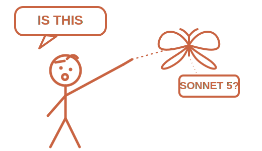

<p align="center">
  
</p>

<h1 align="center">promptify</h1>

<p align="center">
  <em>It's pretty sure you're running Sonnet 5. It'll ask anyway.</em>
</p>

<p align="center">
  
  
  
  
</p>

---

A skill that drafts polished prompts — or Claude Code `/goal` completion conditions, where applicable — tuned to whichever Claude or OpenAI model family is currently running. Neither Anthropic nor OpenAI gives a skill any reliable way to read the active model ID at runtime, and their own docs say so. promptify doesn't pretend otherwise: it guesses, tells you what it guessed, and takes a correction if you give one.

## Before / after

You paste a rough idea into whatever session you happen to have open. The agent drafts something generic — maybe it reaches for a chain-of-thought instruction that actively hurts an o-series model, maybe it invents a `temperature` parameter that 400s on Sonnet 5, maybe it fabricates a `/goal` line for Codex CLI, which has no such mechanism.

With promptify:

```
Detected: Claude Code, Claude Sonnet 5 — say so if wrong.
```

...then the actual drafting happens against that specific model family's rules — not a generic average of every model's prompting advice.

## Install in Claude Code

```
/plugin marketplace add albert-mr/promptify
```
Registers this repo as a plugin marketplace so Claude Code can find and install `promptify`.

```
/plugin install promptify@promptify
```
Installs the `promptify` plugin from that marketplace into your Claude Code environment.

```
/promptify:promptify
```
Invokes the skill to turn your rough idea into a polished prompt or `/goal` completion condition.

## Install in Codex CLI

promptify currently ships to Codex as a direct agent skill. Codex scans `.agents/skills` from your current working directory up to the repo root, and it also scans `$HOME/.agents/skills`. Symlinked skill folders are supported.

- **This repo:** no install step is needed. The checked-in `.agents/skills/promptify` symlink points at `skills/promptify`, so Codex picks it up when you start in this repo or one of its subfolders.
- **Another project:** from this checkout, symlink it into that project's skill directory:

  ```bash
  mkdir -p /path/to/project/.agents/skills
  ln -s "$(pwd)/skills/promptify" /path/to/project/.agents/skills/promptify
  ```

- **Global install:** from this checkout, symlink it into your user skill directory:

  ```bash
  mkdir -p ~/.agents/skills
  ln -s "$(pwd)/skills/promptify" ~/.agents/skills/promptify
  ```

Use `cp -R skills/promptify ...` instead of `ln -s ...` if you want a fixed copy rather than live updates from this checkout. Invoke the skill in Codex with `$promptify`; if it does not appear immediately, restart Codex.

## Repo layout

- `skills/promptify/SKILL.md` — the skill definition itself.
- `skills/promptify/references/*.md` — supporting reference docs:
  - `claude-families.md`
  - `openai-families.md`
  - `goal-vs-normal.md`
  - `detection-fallbacks.md`
- `.claude-plugin/` — Claude Code packaging metadata (marketplace + plugin manifest).
- `.agents/skills/promptify` — symlink used for Codex CLI's repo-level skill discovery.
- `.github/workflows/validate.yml` — CI check that validates the plugin manifests and skill files on every PR.

## Scope and honesty notes

- No provider (Anthropic or OpenAI) gives reliable runtime model-ID introspection — model-family detection here is best-effort and its guess is always disclosed and correctable, never asserted as fact.
- Codex CLI has no equivalent of Claude Code's `/goal` completion-condition primitive, so goal-mode prompt drafting is Claude-Code-only; on Codex, promptify only produces normal (system/task/agent) prompts.
- When in doubt about which model family is actually running, trust your own knowledge of your environment over promptify's guess and correct it.

See [MAINTAINING.md](MAINTAINING.md) for the versioning policy, the update/PR process (including the monthly automated freshness check), and the regression checklist any change must pass.

## License

[MIT](LICENSE) © Albert Martinez
